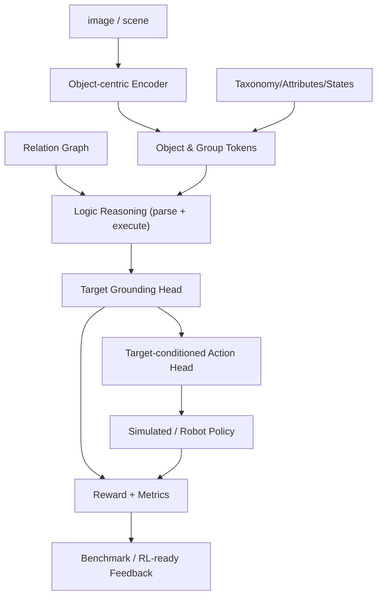

# OARL-VLA 论文草稿（AAAI v0.4）

> 物体逻辑 grounding 未对齐，是 VLA 在复杂指令下错抓/错置的关键原因。  
> 该稿件用于把当前原型落成一份可提交的研究叙事：先明确失败机制，再给出结构化架构和可复现的实验路径。

## Title

推荐 AAAI 标题：

**Wrong Object, Right Action? Diagnosing and Reducing Object-Logic Failures in Vision-Language-Action Models**

备选短标题：

**Ground Before You Act: Object-Logic Grounding for Vision-Language-Action Models**

目前不建议只用 `OARL-VLA: Object-Attribute-Relation-Logic Aware Vision-Language-Action Models`，因为 AAAI 近期 VLA 模型论文很多，单纯“提出一个 VLA”容易被认为拥挤。更强的投稿定位是：**定义 wrong-object manipulation 失败模式 + 提出 OARL-Bench + 给出显式 target grounding 框架**。

---

## 摘要（中文）

现有视觉-语言-动作模型（VLA）在复杂自然语言指令下，常出现“动作正确但对象错误”的失败：虽然模型可能生成了可执行动作序列，但目标对象并非指令真正指代的实例。我们认为这是因为目标选择与动作生成高度耦合、且对象级逻辑监督不足。  

我们提出 OARL-VLA（Object-Attribute-Relation-Logic-aware VLA），以**对象 token、属性/状态 token、关系图、group 结构和可执行逻辑程序**为中间表示，显式建模从语言到目标对象（或目标组）的选择过程，再将目标条件化地输入动作头。项目包含两个数据线：  

1. 可控的合成二维场景（带完整金标标签）；  
2. 可扩展的 web 弱监督真实场景数据（来源可追踪、可人工复核、可继续扩展）。  

我们给出一套可运行的 benchmark 与评测指标（目标命中率、wrong-object 率、按任务细分指标）来量化对象逻辑对齐能力，并提供了规则推理基线与轻量可训练 VLA 原型。该原型支持 `tiny` 纯符号模式与 `qwen_vl` 后端扩展，支持 CPU 小规模复现实验。

## Abstract（English）

Existing vision-language-action models often execute a plausible action against the wrong object. We argue this is a critical but under-measured failure mode of VLA systems: **target-grounding under compositional object logic is under-supervised**.  

We propose **OARL-VLA**, a prototype architecture that explicitly represents a scene with object tokens, attributes/states, relation graphs, group entities, and executable logic programs, and explicitly grounds language instructions to target objects/groups before action generation.  

The project provides two data tracks: (1) synthetic, fully-annotated structured scenes, and (2) web-scale weakly supervised real-image pipelines with provenance and human-review workflows.  

We define a benchmark of compositional object-grounding tasks and report target grounding, wrong-object rate, and task-specific breakdowns. Baselines and a lightweight trainable model (including a Qwen-VL extension path) show a practical route from symbolic reasoning to differentiable training.

## AAAI 投稿版贡献表述

主文建议只保留 4 个贡献，避免显得散：

1. **Wrong-object manipulation as a VLA failure mode.** We separate target correctness from downstream action success and introduce wrong-object rate as a first-class metric.
2. **OARL-Bench.** We construct a compositional object-grounding benchmark covering attributes, states, spatial/ordinal relations, comparison, negation, group grounding, affordance, history reference, fuzzy descriptions, and open-vocabulary categories.
3. **OARL-VLA.** We introduce a target-first architecture with object/group tokens, attribute-state features, a relation graph encoder, executable program supervision, target grounding, and target-conditioned action prediction.
4. **Staged data and training.** We provide synthetic gold data, grid/cutout visual pretraining, and weak web data construction while explicitly preventing weak labels from becoming fake target ground truth.

---

## 1. 引言

传统 VLA 常见的监督目标是动作回归或策略损失，目标选择隐式嵌在网络内部。面对自然语言中的细粒度逻辑（属性、状态、比较级、组、否定、历史、常识）时，模型可能输出看似正确的动作，但作用于错误实例。  

我们认为“可解释、可验证、可优化的目标选择”应作为 VLA 的第一类能力，至少应满足三个问题：

- 指令中到底指代了哪个实例/组？
- 该选择是否满足属性、状态、关系、历史等逻辑约束？
- 当目标被选错时，能否被指标和 reward 显式识别并惩罚？

因此本文不是“再做一个更大模型”，而是把对象逻辑 grounding 从**隐式端到端行为**变成**显式中间任务**。

## 1.5 相关工作与 AAAI 定位

近年 AAAI VLA 方向已经很拥挤，常见主线包括：

- **效率与部署**：如 VLA-Adapter、MoLe-VLA、TTF-VLA，重点是小模型、token/layer 选择和推理效率。
- **时序与失败恢复**：如 TCoT，重点是 trajectory-level 推理和失败后的动作恢复。
- **空间/3D 推理**：如 GraphCoT-VLA，重点是 3D pose-object graph 和 ambiguous instruction planning。
- **动作坐标对齐**：如 OC-VLA，重点是 observation/camera space action grounding。
- **感知/语义对齐**：如 ReconVLA、CCoL，重点是视觉表示、语义-物理一致性。
- **灵巧操作**：如 DexGraspVLA，重点是 dexterous grasping action generation。

本工作不能和这些论文正面比“谁的 VLA 更大/更快/动作更强”。我们的差异点应该写清楚：

```text
Existing AAAI VLA papers mostly optimize action generation, deployment efficiency,
trajectory reasoning, or spatial/task planning. OARL-VLA instead asks whether the
model selected the object that the instruction actually denotes before acting.
```

因此主张应是：

> OARL-VLA is a diagnostic benchmark and target-grounding framework for wrong-object manipulation under compositional object logic.

建议在主文 related work 中把 GraphCoT-VLA 作为最近邻工作：它处理 ambiguous instructions 和 3D spatial reasoning；我们则把任务空间扩展到 attribute/state/negation/group/affordance/history/open-vocabulary，并把 wrong-object rate 作为核心指标。

Primary AAAI sources:

- GraphCoT-VLA: https://ojs.aaai.org/index.php/AAAI/article/view/38896
- TCoT: https://ojs.aaai.org/index.php/AAAI/article/view/37577
- OC-VLA: https://ojs.aaai.org/index.php/AAAI/article/view/38947
- VLA-Adapter: https://ojs.aaai.org/index.php/AAAI/article/view/38931
- ReconVLA: https://ojs.aaai.org/index.php/AAAI/article/view/38921
- MoLe-VLA: https://ojs.aaai.org/index.php/AAAI/article/view/38945
- TTF-VLA: https://ojs.aaai.org/index.php/AAAI/article/view/38910
- CCoL: https://ojs.aaai.org/index.php/AAAI/article/view/39677
- DexGraspVLA: https://ojs.aaai.org/index.php/AAAI/article/view/38953

## 2. 相关问题定义

在本任务中，一个自然语言指令可能同时包含：

- 实例级绑定：`third apple from left`, `pair of shoes`
- 属性/状态判断：`not blackened banana`, `not empty bottle`, `cleanest cup`
- 比较：`largest drink`, `farthest pair of shoes`
- 类别层级：`drinkware`, `fruit`, `container`
- 关系与否定：`not near trash bin`
- 集合/成组：`pair of shoes`
- 历史指代：`I just put down`
- 模糊表达与开放词表：`almost clean cup`, `suitable for drinking`

**失败模式定义：**  
在动作成功但目标错误时，属于 `wrong-object manipulation`；这是与“执行失败”区分开的核心问题。

## 3. 系统目标与方法概览

我们构建 OARL-VLA 原型，围绕以下主线：

1. **结构化场景表示**（场景中实体与关系）  
2. **规则程序推理器**（把指令映射为可执行 `program`）  
3. **目标条件化 VLA**（先选目标，再决定动作）  
4. **可复现评测**（基准任务 + baselines + 指标）  
5. **合成 + web 弱监督**两条数据轨道

整体流程：

```text
image/scene -> object-centric perception -> attributes/states/taxonomy/relation graph -> 
logic program -> target grounding -> target-conditioned action -> reward/eval
```



---

## 4. 形式化定义

### 4.1 场景定义

场景建模为  

```text
S = {O, G, R, H}
```

其中：

- `O`: 对象实例集合（`ObjectInstance`）
- `G`: 对象组集合（`ObjectGroup`）
- `R`: 关系图（left/right/near/far/inside/between/...）
- `H`: 历史事件（`SceneEvent`）

单条指令 `x` 对应目标 `y` 与可执行程序 `p`：

```text
f(S, x) -> (y, p)
```

### 4.2 目标集合

目标是对象实例 `object` 或对象组 `group`，统一编码为 target token：

```text
T = O ∪ G
y ∈ T
```

### 4.3 损失与 reward（当前实现）

训练阶段采用 multi-task 头：

```text
L = L_target + λ_prog * L_program + λ_act * L_action
```

reward 侧以规则形式拆解：

```text
R = R_grounding + R_attribute + R_relation + R_group + R_action + R_success - R_wrong
```

- 当前 `RewardModel` 已实现 `grounding/attribute/relation/action/success/wrong` 规则项的可组合版本。  
- 这是后续 RL 阶段可直接迁移到 preference / trajectory reward 的接口基础。

---

## 5. OARL 场景表示

### 5.1 对象与属性

每个对象携带：

- 类别与上位类目（`taxonomy.py`）
- 几何与外观（bbox/center/size/color/shape/material）
- 状态（如 `is_blackened`, `is_opened`, `is_empty`, `is_broken`）
- 属性（如 `black_spot_ratio`, `fill_level`, `cleanliness`, `volume_ml`, `member_count`）
- 历史标签（`history_tags`）

## 5.2 关系图

关系层包含 `left_of/right_of/near/far/...` 等关系，用于空间推理和关系选择。  
关系用于两处：  
1) 推理器执行 `relation`, `nearest_to`, `farthest_from`, `between`；  
2) 模型的 `SimpleRelationGraphEncoder` 做对象 token 的图消息传播。

### 5.3 组表示

组实体（`ObjectGroup`）独立建模为目标单位，常见包括 `pair_of_shoes`、`stack_of_books`。  
这使 `the farthest pair of shoes` 能直接输出组目标，而不是单个鞋子。

---

## 6. 任务程序表示（Logic Program）

指令解析器 `parser.py` 输出 `Program`，按步骤执行：

```
Program = Step1 -> Step2 -> ... -> StepN
```

典型例子：

- `Pick the banana that has not turned black.`  
  `filter(category='banana') -> filter_state(is_blackened=False) -> argmin(attribute='black_spot_ratio')`

- `Pick the largest drink.`  
  `filter(super_category='drink') -> argmax(attribute='volume_ml', fallback='size')`

- `Pick the farthest pair of shoes.`  
  `filter_group(group_type='pair_of_shoes') -> argmax(attribute='distance_to_origin')`

执行器 `ProgramExecutor` 负责：

1. 集合过滤  
2. 关系筛选  
3. 选择操作（argmax/argmin/nth）  
4. 目标回退与失败原因追踪

该程序可解释、可可视化、可复用到数据合成与错误分析。

---

## 7. OARL-VLA 模型架构

实现文件见 `src/oarlvla/models/`。

### 7.1 模块

- 文本编码：`TextEncoder`（小模型，或 qwen_vl 适配）
- 对象编码：`ObjectEncoder`
- 关系编码：`SimpleRelationGraphEncoder`
- 融合：`CrossAttentionFusion`
- 目标头：`TargetGroundingHead`
- 程序头：`ProgramHead`
- 动作头：`ActionHead`

### 7.2 路由

```text
image/scene + instruction + object features + relation graph
    -> 融合模块
    -> target_logits (目标分类)
    -> 选择 target token
    -> 动作回归 / 分类 (ActionHead)
    -> program_logits (任务类型/程序类型监督)
```

### 7.3 配置变体

`OARLVLAConfig` 支持：

- `vlm_backbone=tiny`（默认轻量）
- `vlm_backbone=qwen_vl`（基于 Hugging Face 的 Qwen-VL，可冻结/解冻）
- `image_mode=symbolic`（结构化特征）或 `cnn_stub`（简易 CNN）

---

## 8. 训练与评测

### 8.1 数据

#### 阶段 A：Synthetic（主干训练与验证）

- 生成：`scripts/generate_dataset.py`
- 样例场景：2D 结构场景（`src/oarlvla/scene.py`）
- 任务类型：
  - spatial_relation / ordinal_relation
  - attribute_comparison
  - state_filtering / negation
  - category_taxonomy
  - group_grounding
  - history_reference / affordance
  - open_vocab / fuzzy_attribute

输出 JSONL 包含 `scene_id`、`instruction`、`program`、`target_id`、`objects`、`groups`、`history` 等字段，可直接用于 `train_vla.py / eval_vla.py / generate` pipeline。

#### 阶段 B：Stage-1 Grid + Cutout（更偏视觉分布）

- 下载/裁剪贴图资产：`scripts/download_grid_assets.py`
- 生成带图像路径的数据：`scripts/generate_grid_dataset.py`
- 可直接接 `train_vla.py`，并以 `source=synthetic_grid`, `label_quality=gold` 进行训练/验证

#### 阶段 C：Web Weak Data（真实图像闭环）

- `scripts/build_web_dataset.py` 支持 local 与 Wikimedia
- `scripts/inspect_web_dataset.py` 提供 manifest 质量摘要与 HTML 复核
- 输出包括 web manifest、annotation、SFT/Preference 候选文件
- Stage-2 训练可将 `data/web_tasks.jsonl` 与 synthetic/grid gold data 混合。无人工验证 target 的 web 样本使用 `target_index=-1`，训练时跳过 target/action loss，仅保留 program/task 监督，避免弱标签污染 grounding 真值。

### 8.2 训练脚本

- `scripts/train_vla.py`
- 支持 `--val-ratio`, `--seed`, `--eval-dataset`
- 支持 tiny 与 qwen_vl 两种主干
- 支持 `--web-weak-dataset` 混合 weak web tasks
- 支持 `--init-checkpoint` 与 `--extend-tokenizer`，用于从 Stage-1 checkpoint 继续 Stage-2 warm-up

### 8.3 评测脚本

- `scripts/run_benchmark.py`：rule-based reasoner + baselines
- `scripts/eval_vla.py`：模型 checkpoint 上的 target/program/action 指标
- 输出：
  - `benchmark_results.json`
  - `benchmark_results.csv`
  - 可视化样例 `outputs/example_*.png`

### 8.4 阶段化流水线

当前仓库提供 `scripts/run_stage_pipeline.py`：

```bash
python scripts/run_stage_pipeline.py --stage all --quick
```

阶段定义：

- `stage0`: 合成数据、符号 benchmark、论文表格生成；
- `stage1`: grid/cutout 视觉数据、tiny VLA 训练、gold eval；
- `stage2`: web weak data 构建、gold+weak mixed training、gold eval。

Learned ablation suite:

```bash
python scripts/run_aaai_ablation_suite.py \
  --dataset data/oarlvla_grid_sprites.jsonl \
  --epochs 2 \
  --batch-size 16
```

It runs `full`, `no_relation_graph`, `no_attribute_state`, `no_group_candidates`, and `no_program_supervision`.

---

## 9. 实验设置（Draft）

### 9.1 基线

1. `Random Object`
2. `Random Same Category`
3. `Attribute-Ignorant`
4. `Relation-Ignorant`
5. `OARL-VLA Logic Reasoner`
6. `OARL-VLA`（可训练模型）

AAAI 版还必须补充：

7. `Direct VLM Grounding`：Qwen-VL / InternVL / GPT-4o-style model 直接从图像和指令回答目标。
8. `Qwen-VL + OARL Head`：使用 Qwen-VL 作为冻结视觉语言骨干，训练 target/program/action head。
9. `Direct VLA / OpenVLA-style Baseline`：若资源允许，加入 OpenVLA 或同类开源 VLA 的目标选择/执行结果。

### 9.2 指标

- **target_accuracy**：`pred_target == gt_target`
- **wrong_object_rate**：`pred_target != gt_target`
- **task_success_rate**：基于规则 reward 成功项
- **attribute_accuracy / state_accuracy / relation_accuracy / group_accuracy / history_accuracy**
- 每类任务的按类 accuracy（`by_task`）

### 9.3 消融建议

论文主文可按以下消融组织：

- 去掉 relation graph encoder
- 去掉属性状态 encoder
- 去掉 group token
- 去掉 program/任务监督
- 不同数据源（synthetic vs synthetic_grid vs web weak）训练对比
- qwen-vl 与 tiny 架构对比

AAAI 主文最少需要 4 个消融：

| 消融 | 预期证明 |
|---|---|
| w/o attribute-state features | 属性/状态任务（未发黑香蕉、非空瓶子、干净杯子）下降 |
| w/o relation graph | spatial/ordinal/group 下降 |
| w/o group candidates | pair-of-shoes 等 group grounding 下降 |
| w/o program supervision | 新模板和组合泛化下降 |

### 9.4 AAAI 必补实验

当前项目已经有可运行原型，但要投稿 AAAI，最低还需要补齐：

1. **训练结果日志**：安装 torch 后完整跑 `scripts/run_stage_pipeline.py --stage all --quick` 与一个正式规模版本。
2. **learned ablations**：给 `OARLVLAModel` 增加可关闭 relation graph / attribute-state / program loss / group candidates 的参数。
3. **Direct VLM baseline**：用 Qwen-VL 对 grid/cutout 图像直接回答目标，再解析成 target id/category。
4. **verified real-image subset**：web weak 只能用于候选收集；最终真实图评测必须人工验证 target/bbox。
5. **论文图表自动化**：将 benchmark/model eval JSON 统一生成 AAAI 表格和图。

---

## 10. 结果与分析（待补齐）

目前原型重点在可复现框架，实验结果可按以下方式自动生成：

- `scripts/run_benchmark.py --num-scenes 200 ...` 产生 `outputs/benchmark_results.json/csv`
- `scripts/eval_vla.py --dataset ... --checkpoint ...` 评估模型
- 可视化样例展示 target-grounding 与错误案例

你可以使用本文附带脚本将 JSON 指标转为论文表：

```bash
python scripts/make_paper_tables.py --input outputs/benchmark_results.json --out-md outputs/benchmark_paper_tables.md
```

### 表 1（示意模板）

| 方法 | Target Acc | Wrong-object | Action/Task Success | Attribute | State | Relation | Group | History |
|---|---:|---:|---:|---:|---:|---:|---:|
| OARL-VLA Reasoner | - | - | - | - | - | - | - | - |
| Random Object | - | - | - | - | - | - | - | - |
| Random Same Category | - | - | - | - | - | - | - | - |
| Attribute-Ignorant | - | - | - | - | - | - | - | - |
| Relation-Ignorant | - | - | - | - | - | - | - | - |

（表内“-”由你每次跑完后替换）

---

## 11. 失败分析与可解释性

每条推理都输出 trace：

1. 过滤过程中的候选集变化  
2. 属性/状态过滤路径  
3. relation / ordinal 选择  
4. 最终失败原因（如 no candidates）

这部分 trace 同时用于：
- 可视化图注说明
- 规则误差分析
- 反馈到数据生成器（自动增加边界样本）

---

## 12. 与现有 VLA 思路的关系

- 与“端到端 VLA”对比，本方法不否定动作策略，而是把**对象选择**前置并显式监督；
- 与 “RL 后训练”关系，本项目可把 `R_wrong_object_penalty`、`R_attribute`、`R_relation` 分量作为过程奖励；
- 与 “真实机器人系统”关系，本原型不依赖真实硬件，先验证对象逻辑能力闭环，再对接执行器。

---

## 13. 局限性

1. 当前规则解析器覆盖有限语种与模板，中文支持尚可扩展；
2. web 轨道仍以弱监督为主（人工复核仍关键）；
3. 真实机械臂执行器仅使用模拟策略；
4. 实验规模需后续扩增到更大真实数据与更多跨域检验。

---

## 14. 下一步工作

AAAI 优先级从高到低：

1. 跑通 Stage-1/Stage-2 训练并产出正式结果表；
2. 补 learned ablations；
3. 补 Direct VLM baseline；
4. 构造 verified real-image eval subset；
5. 再考虑 RL/post-training 扩展。

RL/post-training 可以作为未来工作，不建议作为 AAAI 主贡献，否则实验压力会过大。

---

## 15. 可复现命令清单（与你的当前脚本一一对应）

### 数据生成

```bash
python scripts/generate_dataset.py --num-scenes 200 --objects-per-scene 12 --seed 42 --output data/oarlvla_synthetic.jsonl
python scripts/download_grid_assets.py --asset-dir data/grid_assets --raw-dir data/grid_asset_raw --manifest data/grid_assets_manifest.json --force
python scripts/generate_grid_dataset.py --num-scenes 100 --grid-size 8 --cell-size 64 --seed 42 --output data/oarlvla_grid_sprites.jsonl
python scripts/build_web_dataset.py --source wikimedia --queries configs/web_queries.yaml --max-per-query 5 --output-dir data/web_dataset
python scripts/build_web_dataset.py --source local --input-dir tests/fixtures/images --queries configs/web_queries.yaml --output-dir data/web_dataset
```

### 训练与评测

```bash
python scripts/train_vla.py --dataset data/oarlvla_synthetic.jsonl --epochs 2 --batch-size 16 --hidden-dim 128 --output checkpoints/oarlvla_tiny.pt
python scripts/train_vla.py --dataset data/oarlvla_grid_sprites.jsonl --epochs 2 --batch-size 32 --hidden-dim 128 --val-ratio 0.15 --output checkpoints/oarlvla_grid_stage1.pt
python scripts/eval_vla.py --dataset data/oarlvla_synthetic.jsonl --checkpoint checkpoints/oarlvla_tiny.pt
python scripts/run_benchmark.py --num-scenes 200 --objects-per-scene 12 --seed 42
python scripts/inspect_web_dataset.py --manifest data/web_manifest.jsonl --export-review-html outputs/review.html
python scripts/make_paper_tables.py --input outputs/benchmark_results.json --out-md outputs/benchmark_paper_tables.md
```

### 一键示例（可改成你实验日志中的命令）

```bash
python scripts/run_demo.py --seed 0 --instruction-type state_filtering
python scripts/run_demo.py --seed 1 --instruction-type attribute_comparison
python scripts/run_demo.py --seed 2 --instruction-type group_grounding
```

---

## 附录 A：当前仓库状态与任务完成度

当前 prototype 的可交付模块（已实现）：

- 逻辑推理器、程序执行器、基线、奖励模型、可视化
- 合成场景与任务生成
- grid/world asset 下载裁剪 + stage-1 合成图像数据
- 轻量模型训练与评测（含 qwen_vl adapter）
- web 数据构建、quality filter、去重、人工复核 HTML
- 全量测试覆盖

待在下一版补齐的点：

- 结果可视化图（论文 Figure 1/2/3）自动化脚本
- 更完整中文解析模板与 domain-general 误差分析
- 更大规模跨域真实图样本上的实验

---

## 附录 B：引用格式（可直接用于模板）

- 代码仓库与配置可复现路径见本仓库 README 与脚本参数（建议在方法部分补充 commit 哈希与执行参数）。
- 数据与模型文件请遵循 `.gitignore`，仅提交 schema 示例和配置，不上传原始图片与权重。
