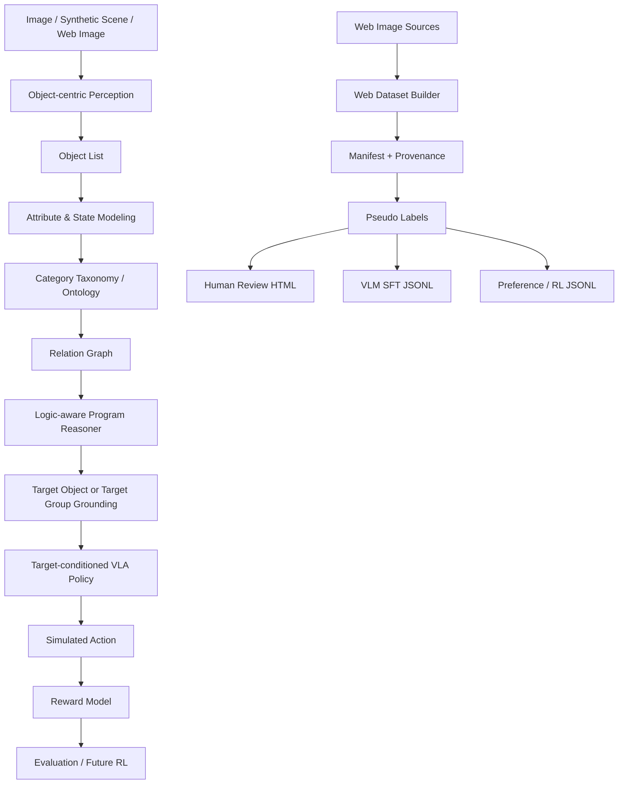
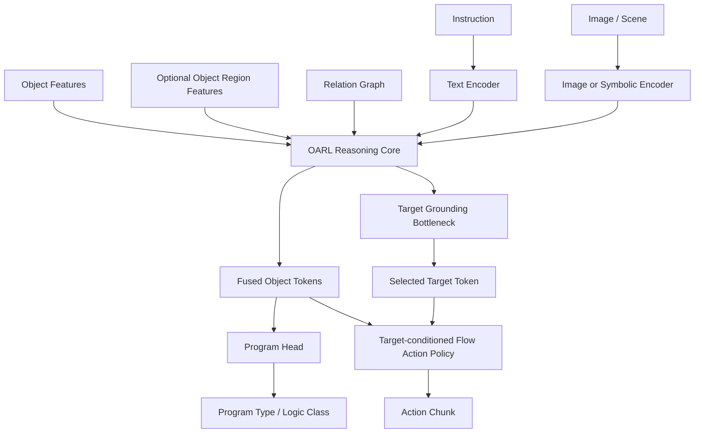

# OARL-VLA: Object-Attribute-Relation-Logic-Aware VLA

OARL-VLA is a minimal research prototype for studying why VLA systems fail on everyday robot instructions that require more than coarse object category recognition. The project tests an explicit object-attribute-relation-logic intermediate representation before a target-conditioned action policy.

普通 VLA 在真实指令中常常不是只输在空间关系上，还会输在实例绑定、属性/状态、类别常识、比较级、集合和成组对象、否定逻辑、模糊表达、历史指代、开放词表 grounding 与 affordance 推理上。例如 "Pick the banana that has not turned black" 需要状态建模；"Pick the farthest pair of shoes" 需要 group grounding；"Pick the object suitable for drinking coffee" 需要常识和 affordance。

This MVP has two parts:

1. Synthetic MVP: deterministic 2D/structured household scenes with gold labels for strict reasoning and grounding evaluation.
2. Web Image Dataset Builder: compliant local/Wikimedia-ready weak data pipeline with provenance, pseudo labels, quality scores, SFT/preference export, and human review HTML.

## Architecture



## Implemented Modules

- Core schemas: `ObjectInstance`, `ObjectGroup`, `Scene`, `SceneEvent`, `GroundingSample`.
- Taxonomy: fruit, drink, container, footwear, drinkware, utensil, electronics, readable object.
- Attribute/state rules: banana blackening/rotting/edibility, drink opened/fill/empty, cup cleanliness/broken/coffee suitability, shoe pair cleanliness/wearability.
- Relation helpers: left/right/above/below/near/far, nth from left/right, nearest/farthest, not near, between.
- Executable programs: natural language templates map to `ProgramStep` chains, then `ProgramExecutor` runs them over scene objects/groups.
- Logic reasoner: returns target id/type, executable program, reasoning trace, confidence, and failure reason.
- Baselines: random object, random same category, attribute-ignorant, relation-ignorant.
- Policy/reward: target-conditioned simulated grasp point and rule reward breakdown.
- Visualization: annotated PNG output, with matplotlib/Pillow path when installed and a pure-stdlib PNG fallback.
- Web data: local directory source, Wikimedia source, manifest, exact hash dedup, pseudo labeler, quality filter, review HTML, SFT and preference exports.

## 与论文目标对应的完成度

当前已经落地的主线：

- 目标选择显式建模：`ObjectToken/ObjectGroup -> 逻辑程序 -> TargetGroundingHead`（不是直接 `image+text -> action`）。
- 错抓失败机制是核心指标之一：`target_accuracy / wrong-object` 已有可执行定义。
- 合成金标场景与真实图片 weak data 两条数据线同时存在，且都有 provenance、复核与训练导出。
- 支持的任务类型已覆盖你文本里提到的关键面：`spatial / ordinal / attribute / state / taxonomy / group / negation / affordance / history / open_vocab / fuzzy_attribute`。

还缺口：

- 没有把训练固定为标准 `train / val / test` 流程；stage-2 真实图像训练还缺一个默认基准脚本。
- 任务程序头目前是任务分类（program type），还没演进到完整程序 token 序列生成。
- 开放词表/模糊描述（fuzzy/open-vocab）已补基础规则与模板，但还建议扩展更多自然语言变体并做泛化消融。

下一步推荐顺序：

1. 固定 split 后跑两版对比（带/不带 target head）。
2. 用 weak web data 做小规模预热，再接 Stage-1 synthetic checkpoint。
3. 在 `eval_vla.py` 输出按任务类型的 `wrong-object` + `target accuracy` 可对齐图表。

## Supported Instruction Types

- `spatial_relation`: nearest/farthest/left/right/between.
- `ordinal_relation`: nth object from left/right.
- `attribute_comparison`: largest, smallest, cleanest, dirtiest, fullest, emptiest.
- `state_filtering`: not blackened banana, blackened banana, unopened drink, not empty bottle.
- `category_taxonomy`: largest drink, edible fruit, cleanest drinkware.
- `group_grounding`: farthest/nearest/cleanest pair of shoes.
- `negation`: fruit not near trash bin, not opened drink, not empty bottle.
- `history_reference`: object just put down or moved most recently.
- `affordance`: object suitable for drinking coffee.
- `open_vocab`: container, drinking container, writable object, edible object（开放词表/同义改写）。
- `fuzzy_attribute`: almost clean, kinda fresh, not too dirty, roughly biggest（模糊表达约束）。

The first version uses English templates. The parser and generator are structured so Chinese templates can be added later.

## Categories, Attributes, States, Groups

Object categories include `apple`, `banana`, `orange`, `bottle`, `water_bottle`, `can`, `soda_can`, `juice_box`, `cup`, `mug`, `shoe`, `spoon`, `bowl`, `trash_bin`, `book`, and `remote`.

Attributes include size, color, shape, material, volume, liquid type, ripeness, black spot ratio, cleanliness, side, capacity, and brightness hooks.

States include `is_blackened`, `is_rotten`, `is_edible`, `is_opened`, `fill_level`, `is_empty`, `is_broken`, `is_usable`, and `is_wearable`.

Group types include `pair_of_shoes`, `stack_of_books`, and extension points for `set_of_cups` and `group_of_fruits`. Shoe-pair instructions target the group id, not an individual shoe.

## Installation

Python 3.10+ is recommended. The code is intentionally lightweight and the synthetic path can run without GPU or model weights.

```bash
cd object-attribute-relation-logic-vla
python -m venv .venv
source .venv/bin/activate
pip install -r requirements.txt
```

On systems where `python` is not available, use `python3` in the commands below.

## Demo

```bash
python scripts/run_demo.py --seed 0 --instruction-type state_filtering
python scripts/run_demo.py --seed 1 --instruction-type attribute_comparison
python scripts/run_demo.py --seed 2 --instruction-type group_grounding
python scripts/run_demo.py --seed 3 --instruction-type negation
```

Demo PNGs are saved under `outputs/`, for example `outputs/demo_state_filtering_seed0.png`.

## Synthetic Benchmark

```bash
python scripts/run_benchmark.py \
  --num-scenes 100 \
  --objects-per-scene 12 \
  --seed 42
```

Outputs:

- `outputs/benchmark_results.json`
- `outputs/benchmark_results.csv`
- `outputs/example_success.png`
- `outputs/example_failure.png` if a logic failure occurs
- `outputs/example_attribute_task.png`
- `outputs/example_group_task.png`

Example small-run result from this environment: the logic reasoner reached 1.000 target accuracy on generated gold tasks; random/category-only/attribute-ignorant/relation-ignorant baselines were lower on the task types they ignore.

## Synthetic Dataset Export

```bash
python scripts/generate_dataset.py \
  --num-scenes 50 \
  --objects-per-scene 12 \
  --seed 42 \
  --output data/oarlvla_synthetic.jsonl
```

Each JSONL row contains a scene, instruction, executable program, gold target id/type, task type, object/group lists, and reasoning steps.

## Web Dataset Builder

The web pipeline is designed for provenance and review, not blind scraping. It supports:

- Local directory source: user-provided images.
- Wikimedia Commons API: open image search with license/author/source metadata when network and `requests` are available.
- Reserved extension points: Hugging Face datasets, Open Images, COCO/LVIS/Objects365, Unsplash API via `UNSPLASH_ACCESS_KEY`.

Configure query intents in `configs/web_queries.yaml`.

Local import:

```bash
python scripts/build_web_dataset.py \
  --source local \
  --input-dir tests/fixtures/images \
  --queries configs/web_queries.yaml \
  --output-dir data/web_dataset \
  --mode metadata_only
```

Wikimedia, if network is available:

```bash
python scripts/build_web_dataset.py \
  --source wikimedia \
  --queries configs/web_queries.yaml \
  --max-per-query 5 \
  --output-dir data/web_dataset \
  --mode metadata_only
```

If network or `requests` is unavailable, Wikimedia returns no records and the project remains usable through local source.

Outputs:

- `data/web_manifest.jsonl`
- `data/web_tasks.jsonl`
- `data/annotations/{image_id}.json`
- `data/oarlvla_web_sft.jsonl`
- `data/oarlvla_web_preferences.jsonl`
- `outputs/web_dataset_report.json`

## Compliance Notes

Do not indiscriminately crawl images. Use open datasets or open-license sources first. Each `WebImageRecord` stores source URL, license, author, query, download/import time, dimensions, sha256, split, and raw metadata. Do not download content that requires login/payment, violates site rules, or contains sensitive personal data such as face closeups, children, IDs, license plates, NSFW, violence, illegal content, or medical privacy material.

Real images and generated data files are ignored by `.gitignore`; only schema examples and tiny fixtures are committed.

## Label Quality

Synthetic gold labels are for strict evaluation, relation/logic module validation, and program executor tests.

Web weak labels are for visual diversity expansion, VLM SFT candidates, and human review queues. They must not be treated as final evaluation ground truth.

Model-assisted labels can add bbox/mask/candidate targets through future GroundingDINO, SAM/SAM2, Florence-2, OWL-ViT, CLIP, Qwen-VL, InternVL, or LLaVA integrations, but still require quality filtering.

Manual verified labels are the right source for final real-image eval sets or high-quality SFT.

## Pseudo Label Modes

- `metadata_only`: query and provenance metadata only.
- `heuristic`: metadata plus lightweight image statistics/filename/query rules.
- `model_assisted`: extension point; no large model is required in this MVP and it falls back safely.

Weak web tasks never invent object-level `target_id` without verified bbox/mask/candidate evidence. They use target descriptions and `requires_manual_verification=true`.

## Review HTML

```bash
python scripts/inspect_web_dataset.py \
  --manifest data/web_manifest.jsonl \
  --export-review-html outputs/review.html
```

The HTML shows the image, source, license, query, generated instruction, pseudo labels, quality score, and manual-review requirement.

## VLM SFT and Preference/RL Data

SFT rows are saved to `data/oarlvla_web_sft.jsonl`. Assistant messages contain a program, target description, confidence, and label quality, not fake ids.

Preference rows are saved to `data/oarlvla_web_preferences.jsonl`, with rule-generated chosen/rejected candidate programs. Weak preference data is suitable for pretraining/candidate filtering, not strict final evaluation.

The reward model exposes grounding, attribute, relation, action, success, and wrong-object terms. It can be used later for rejection sampling fine-tuning, DPO/preference optimization, PPO/GRPO, or trajectory-level RL.

## Active Query Suggestion

```bash
python scripts/suggest_queries.py \
  --benchmark-report outputs/benchmark_results.json \
  --existing-queries configs/web_queries.yaml \
  --output outputs/suggested_queries.yaml
```

The first version uses rules to suggest more data for low-accuracy or under-sampled task types such as blackened bananas, pair of shoes, coffee-suitable cups, and largest drinks.

## OARL-VLA Model Architecture

The trainable model in `src/oarlvla/models/` is a tiny symbolic OARL-VLA prototype. It is not a large-scale pretrained VLA. Its role is to verify that the project schema can drive a learnable loop:

```text
scene/image features + instruction
→ object-centric scene tokens
→ OARL reasoning core
→ target grounding bottleneck
→ program/task prediction
→ target-conditioned flow-matching action chunk prediction
→ multi-task loss
```



Current components:

- `vlm_backbone="tiny"` keeps the lightweight `SimpleTokenizer` plus GRU `TextEncoder`, with no large tokenizer dependency.
- `vlm_backbone="qwen_vl"` loads a Qwen-VL/Qwen2.5-VL style Hugging Face backbone through `QwenVLBackbone`; its pooled multimodal hidden state becomes the instruction/image embedding fused with object and relation tokens.
- `QwenVLProcessorAdapter` builds Qwen chat messages and uses `AutoProcessor`; when available, `qwen-vl-utils` handles image/video preprocessing.
- `OARLReasoningCore`, the model's object-centric reasoning core containing `ObjectEncoder`, optional region-feature projection, `SimpleRelationGraphEncoder`, `CrossAttentionFusion`, `TargetGroundingHead`, and global/action-context pooling.
- `ObjectEncoder` over a fixed 35-dimensional symbolic feature vector.
- Optional `object_region_features [batch, num_candidates, region_dim]` can be fused into object tokens through `OARLVLAConfig.region_feature_dim`; this is the intended hook for object crop, mask, or detector/segmenter region embeddings.
- Attribute/state inputs: `black_spot_ratio`, `ripeness`, `is_blackened`, `is_rotten`, `is_edible`, `volume_ml`, `fill_level`, `is_opened`, `is_empty`, `cleanliness`, `is_broken`, `is_wearable`.
- `SimpleRelationGraphEncoder`, a lightweight batched message-passing layer over `edge_index` and `edge_type`; it does not require PyG.
- `CrossAttentionFusion`, where object tokens attend to instruction/image context.
- `TargetGroundingHead`, producing `[batch, num_candidates]` target logits.
- `ProgramHead`, currently predicting task/program type classification rather than autoregressive programs.
- `SmolStyleFlowActionHead`, a lightweight SmolVLA-inspired flow-matching action expert. It embeds noisy action chunks plus a sinusoidal timestep, attends to `global token + selected target token + text/Qwen token + fused object tokens`, predicts the velocity field, and samples an action chunk by iterative denoising. `action_head_type="mlp"` remains available for legacy/debug runs.
- Multi-task loss: `target_loss + 0.5 * action_flow_loss + 0.2 * program_loss`, while `action_mse` is still reported against the first predicted action step for quick diagnostics.

The raw image path is reserved through both `SimpleCNNImageEncoder` (`image_mode=cnn_stub`) and the Qwen-VL backbone path. The default fast training path remains `vlm_backbone=tiny`, `image_mode=symbolic`, using synthetic scene object features.

Install PyTorch before model training:

```bash
pip install torch
```

or:

```bash
pip install -r requirements.txt
```

If PyTorch is unavailable, model scripts fail with a clear install message. GPU is not required; all scripts default to CPU.

For Qwen-VL-backed experiments, install the optional VLM dependencies and choose a Qwen model checkpoint:

```bash
pip install transformers qwen-vl-utils accelerate
```

Example Qwen-VL configuration:

```bash
python scripts/train_vla.py \
  --dataset data/oarlvla_synthetic.jsonl \
  --epochs 1 \
  --batch-size 2 \
  --hidden-dim 128 \
  --vlm-backbone qwen_vl \
  --qwen-model-name Qwen/Qwen2.5-VL-3B-Instruct \
  --output checkpoints/oarlvla_qwenvl.pt
```

This downloads/loads the Qwen checkpoint through Transformers. Use a small batch size on CPU; GPU or MPS is recommended for real Qwen-VL training. By default the Qwen-VL backbone is frozen and only the OARL-VLA projection/fusion/heads train.

Action head controls:

```bash
python scripts/train_vla.py \
  --dataset data/oarlvla_synthetic.jsonl \
  --action-head-type flow_matching \
  --action-chunk-size 8 \
  --action-denoise-steps 10
```

The prototype default is `chunk_size=8` for fast CPU tests. For LIBERO / ManiSkill / robomimic-scale experiments, use larger chunks such as 16-50 once real action trajectories are available.

### Train Tiny VLA

```bash
python scripts/generate_dataset.py \
  --num-scenes 200 \
  --objects-per-scene 12 \
  --seed 42 \
  --output data/oarlvla_synthetic.jsonl

python scripts/train_vla.py \
  --dataset data/oarlvla_synthetic.jsonl \
  --epochs 2 \
  --batch-size 16 \
  --hidden-dim 128 \
  --val-ratio 0.2 \
  --output checkpoints/oarlvla_tiny.pt
```

如果你想用单独验证集文件：

```bash
python scripts/train_vla.py \
  --dataset data/oarlvla_synthetic.jsonl \
  --eval-dataset data/oarlvla_synthetic_val.jsonl \
  --epochs 2 \
  --batch-size 16 \
  --hidden-dim 128
```

The checkpoint stores model weights, config, tokenizer vocabulary, feature metadata, and training history. Checkpoints are ignored by Git except `checkpoints/.gitkeep`.

### Stage 1 Grid/Cutout Pretraining

Stage 1 is a controllable 2D grid world with transparent household-object cutouts instead of text labels or letter placeholders. It is designed to train object binding, spatial/ordinal relations, group grounding, history reference, affordance, state filtering, and target-conditioned action before moving to noisy real RGB images.

The asset set covers common household objects such as apples, bananas, oranges, bottles, cups, mugs, shoes, spoons, bowls, trash bins, books, and remotes. By default, assets can be downloaded from Wikimedia Commons, converted into transparent cutouts, and tracked with source URL, license, author, and score metadata.

Each scene samples a fresh layout, object scale jitter, state combination, shoe-pair/book-stack placement, and optional distractor objects while preserving the relation constraints needed by the instruction templates.

Training renders do not draw group bounding boxes or other target hints. For visual debugging only, pass `--debug-group-boxes` to `scripts/generate_grid_dataset.py`; group membership remains available in JSONL annotations either way.

Download and preprocess web cutout assets:

```bash
python scripts/download_grid_assets.py \
  --asset-dir data/grid_assets \
  --raw-dir data/grid_asset_raw \
  --manifest data/grid_assets_manifest.json \
  --candidates-per-query 5 \
  --sprite-size 192 \
  --force
```

Then generate a gold grid/cutout dataset:

```bash
python scripts/generate_grid_dataset.py \
  --num-scenes 1000 \
  --grid-size 8 \
  --cell-size 64 \
  --seed 42 \
  --output data/oarlvla_grid_sprites.jsonl \
  --image-dir data/grid_images \
  --asset-dir data/grid_assets
```

These commands write ignored local artifacts under `data/grid_images`, `data/grid_assets`, `data/grid_asset_raw`, `data/grid_assets_manifest.json`, and `data/oarlvla_grid_sprites.jsonl`.

Each row includes:

```text
image_path
objects / groups
instruction
program
target_id / target_type
target_bbox / target_center
label_quality=gold
source=synthetic_grid
```

Train and evaluate the Stage 1 VLA baseline:

```bash
python scripts/train_vla.py \
  --dataset data/oarlvla_grid_sprites.jsonl \
  --epochs 20 \
  --batch-size 32 \
  --hidden-dim 128 \
  --val-ratio 0.15 \
  --output checkpoints/oarlvla_grid_stage1.pt

python scripts/eval_vla.py \
  --dataset data/oarlvla_grid_sprites.jsonl \
  --checkpoint checkpoints/oarlvla_grid_stage1.pt
```

Last recorded Stage 1 baseline result on 1000 generated samples:

```text
Target Accuracy: 0.651
Program Accuracy: 0.659
Action MSE: 0.020135
```

Strong task slices include history reference, ordinal relation, affordance, and group grounding. Negation and some comparison/spatial cases remain useful targets for the next curriculum iteration.

### Evaluate Tiny VLA

```bash
python scripts/eval_vla.py \
  --dataset data/oarlvla_synthetic.jsonl \
  --checkpoint checkpoints/oarlvla_tiny.pt
```

The evaluator prints target accuracy, program accuracy, action MSE, task breakdown, and rule/baseline comparison.

### Stage Pipeline

For reproducible staged experiments, use the pipeline runner:

```bash
python scripts/run_stage_pipeline.py --stage all --quick
```

Stages:

- `stage0`: synthetic data, symbolic benchmark, and paper tables.
- `stage1`: grid/cutout image data, tiny VLA training, and gold evaluation.
- `stage2`: weak web task construction plus mixed gold/weak VLA training.

Stage-2 weak web samples usually do not have verified target ids. The trainer masks target/action losses for those rows and keeps program/task supervision, so weak labels do not become fake grounding truth.

Default freezing policy:

- Stage 1 grid/cutout: train all tiny OARL-VLA modules from scratch.
- Stage 2 synthetic + web weak: load Stage-1 checkpoint and freeze `object_encoder`, `graph_encoder`, and `action_head`; train text/fusion/target/program layers.
- Optional Qwen-VL: the Qwen-VL base model is frozen by default; OARL projection/fusion/heads train unless `--unfreeze-qwen-vl` is passed.

You can run each stage separately:

```bash
python scripts/run_stage_pipeline.py --stage stage0
python scripts/run_stage_pipeline.py --stage stage1 --quick
python scripts/run_stage_pipeline.py --stage stage2 --quick
```

Manual Stage-2 mixed training:

```bash
python scripts/build_web_dataset.py \
  --source local \
  --input-dir tests/fixtures/images \
  --queries configs/web_queries.yaml \
  --max-per-query 2 \
  --output-dir data/web_dataset \
  --mode metadata_only

python scripts/train_vla.py \
  --dataset data/oarlvla_synthetic.jsonl \
  --web-weak-dataset data/web_tasks.jsonl \
  --eval-dataset data/oarlvla_synthetic.jsonl \
  --epochs 1 \
  --batch-size 16 \
  --hidden-dim 128 \
  --output checkpoints/oarlvla_stage2_web_weak.pt
```

AAAI ablation suite:

```bash
python scripts/run_aaai_ablation_suite.py \
  --dataset data/oarlvla_grid_sprites.jsonl \
  --epochs 2 \
  --batch-size 16
```

It runs learned variants for `full`, `no_relation_graph`, `no_attribute_state`, `no_group_candidates`, and `no_program_supervision`.

### Tiny Overfit Sanity Check

```bash
python scripts/overfit_tiny_batch.py
```

This generates a tiny synthetic batch and trains until the target grounding head can overfit it. It is a fast sanity check for forward pass, loss, optimizer, dataset, collate, and checkpoint plumbing.

### Model Limits and Upgrade Path

Current implementation has two modes: a tiny symbolic mode for fast CPU tests and a Qwen-VL-backed OARL-VLA mode for VLM-grounded experiments. It is still not a large-scale robot-pretrained foundation policy, but it is a full target-first VLA architecture: object tokens, attribute/state features, relation graph encoding, Qwen/text instruction encoding, target grounding bottleneck, flow action policy, and multi-task training.

Upgrade path:

- Use Qwen-VL as the default multimodal backbone inside OARL-VLA, then fine-tune with LoRA/QLoRA instead of full-weight training.
- Replace or compare Qwen-VL with CLIP, SigLIP, DINOv2, InternVL, LLaVA, or a task-specific visual encoder.
- Feed object candidates from GroundingDINO/OWL-ViT plus SAM/SAM2 masks.
- Extend the current SmolVLA-style flow action head with real robot action chunks, action masks, and benchmark-specific continuous action normalization.
- Use web weak data for SFT/preference warm-up, then promote verified data into evaluation.
- Use the existing reward model for RL or preference post-training.

## Tests

```bash
pytest -q
```

Tests cover taxonomy, states, attributes, groups, relations, instruction generation, program execution, benchmark execution, visualization, manifest schema, query config loading, local directory import, sha256 dedup, quality filtering, pseudo labeling, web task export, review HTML, model forward shape, model backward training step, checkpoint save/load, and tiny-batch overfit. Network logic is not required by tests.

## Future VLM / VLA Integration

`src/oarlvla/interfaces.py` defines extension points for `ObjectDetector`, `VLMReasoner`, `ProgramGenerator`, `VLAActionPolicy`, `PreferenceDataBuilder`, and `RLTrainer`.

Suggested next integrations:

- GroundingDINO or OWL-ViT for open-vocabulary boxes.
- SAM/SAM2 for masks.
- Qwen-VL, InternVL, LLaVA, or Florence-2 for attribute/state descriptions.
- A learned program generator trained on synthetic gold programs.
- A real VLA policy that consumes image, object candidates, instruction, and grounded target.

## Paper Draft

论文草稿见 [PAPER.md](PAPER.md)。该文件给出完整的论文叙事结构（背景、方法、实验、指标、复现实验清单），以及“错误抓取”与对象逻辑 grounding 的研究主线。

AAAI 投稿路线见 [AAAI_SUBMISSION_PLAN.md](AAAI_SUBMISSION_PLAN.md)。该文件对齐近年 AAAI VLA 论文脉络，明确当前论文应主打 `wrong-object manipulation + OARL-Bench + target-first VLA`，并列出 AAAI 主文必须补齐的实验。

训练迁移清单见 [TRAINING_READINESS.md](TRAINING_READINESS.md)。当前已经生成 `data/training_bundle/`，包含 train/val/test split、manifest 和可在算力机器执行的 `compute_training_commands.sh`。

StarVLA/LIBERO 算力机执行说明见 [STARVLA_COMPUTE_RUNBOOK.md](STARVLA_COMPUTE_RUNBOOK.md)。`integrations/starvla/` 提供 `OARLVLAQwenPI` framework overlay，用 StarVLA 的 LIBERO dataloader/trainer/evaluator 跑我们的完整 OARL-VLA，而不是把模型降级成外部插件。

LIBERO / ManiSkill / robomimic 后续评测配置见 [configs/external_benchmarks.yaml](configs/external_benchmarks.yaml)，当前作为 optional benchmark integrations 规划，不引入重依赖。

你可以用下面命令把基准结果转成论文可贴表格：

```bash
python scripts/make_paper_tables.py \
  --input outputs/benchmark_results.json \
  --out-md outputs/benchmark_paper_tables.md
```

## GitHub Push

Initialize and commit:

```bash
git init
git add .
git commit -m "Initial MVP for object-attribute-relation-logic-aware VLA"
```

If a remote already exists:

```bash
git branch -M main
git push -u origin main
```

If GitHub CLI is installed and authenticated:

```bash
gh repo create object-attribute-relation-logic-vla --public --source=. --remote=origin --push
```

Never commit API keys, tokens, cookies, SSH private keys, `.env`, model weights, virtual environments, caches, large datasets, or real image dumps.
