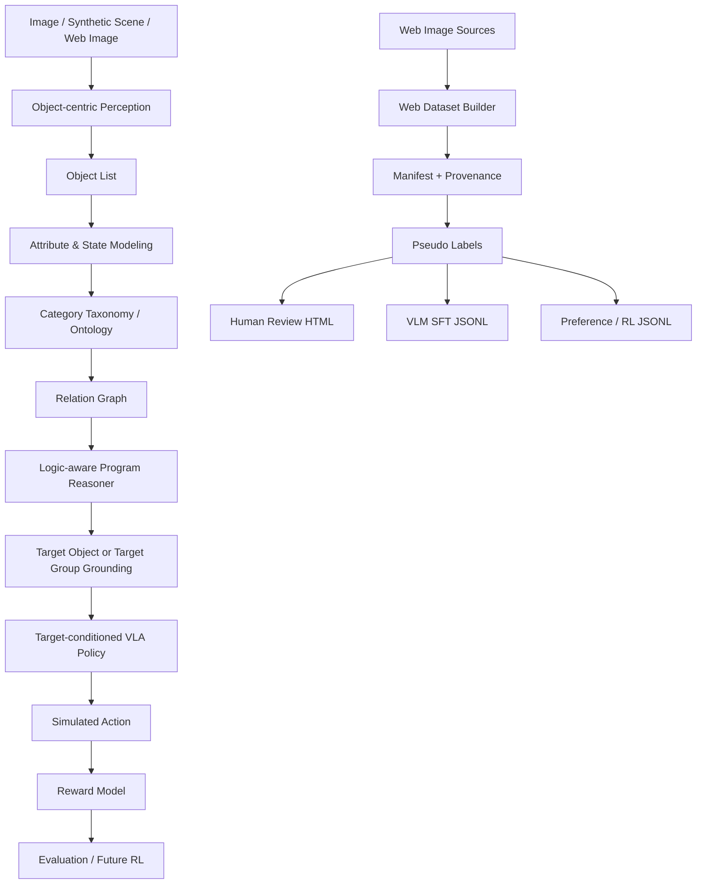

# OARL-VLA: Object-Attribute-Relation-Logic-Aware VLA

OARL-VLA is a minimal research prototype for studying why VLA systems fail on everyday robot instructions that require more than coarse object category recognition. The project tests an explicit object-attribute-relation-logic intermediate representation before a target-conditioned action policy.

普通 VLA 在真实指令中常常不是只输在空间关系上，还会输在实例绑定、属性/状态、类别常识、比较级、集合和成组对象、否定逻辑、模糊表达、历史指代、开放词表 grounding 与 affordance 推理上。例如 "Pick the banana that has not turned black" 需要状态建模；"Pick the farthest pair of shoes" 需要 group grounding；"Pick the object suitable for drinking coffee" 需要常识和 affordance。

This MVP has two parts:

1. Synthetic MVP: deterministic 2D/structured household scenes with gold labels for strict reasoning and grounding evaluation.
2. Web Image Dataset Builder: compliant local/Wikimedia-ready weak data pipeline with provenance, pseudo labels, quality scores, SFT/preference export, and human review HTML.

## Architecture



## Implemented Modules

- Core schemas: `ObjectInstance`, `ObjectGroup`, `Scene`, `SceneEvent`, `GroundingSample`.
- Taxonomy: fruit, drink, container, footwear, drinkware, utensil, electronics, readable object.
- Attribute/state rules: banana blackening/rotting/edibility, drink opened/fill/empty, cup cleanliness/broken/coffee suitability, shoe pair cleanliness/wearability.
- Relation helpers: left/right/above/below/near/far, nth from left/right, nearest/farthest, not near, between.
- Executable programs: natural language templates map to `ProgramStep` chains, then `ProgramExecutor` runs them over scene objects/groups.
- Logic reasoner: returns target id/type, executable program, reasoning trace, confidence, and failure reason.
- Baselines: random object, random same category, attribute-ignorant, relation-ignorant.
- Policy/reward: target-conditioned simulated grasp point and rule reward breakdown.
- Visualization: annotated PNG output, with matplotlib/Pillow path when installed and a pure-stdlib PNG fallback.
- Web data: local directory source, Wikimedia source, manifest, exact hash dedup, pseudo labeler, quality filter, review HTML, SFT and preference exports.

## Supported Instruction Types

- `spatial_relation`: nearest/farthest/left/right/between.
- `ordinal_relation`: nth object from left/right.
- `attribute_comparison`: largest, smallest, cleanest, dirtiest, fullest, emptiest.
- `state_filtering`: not blackened banana, blackened banana, unopened drink, not empty bottle.
- `category_taxonomy`: largest drink, edible fruit, cleanest drinkware.
- `group_grounding`: farthest/nearest/cleanest pair of shoes.
- `negation`: fruit not near trash bin, not opened drink, not empty bottle.
- `history_reference`: object just put down or moved most recently.
- `affordance`: object suitable for drinking coffee.

The first version uses English templates. The parser and generator are structured so Chinese templates can be added later.

## Categories, Attributes, States, Groups

Object categories include `apple`, `banana`, `orange`, `bottle`, `water_bottle`, `can`, `soda_can`, `juice_box`, `cup`, `mug`, `shoe`, `spoon`, `bowl`, `trash_bin`, `book`, and `remote`.

Attributes include size, color, shape, material, volume, liquid type, ripeness, black spot ratio, cleanliness, side, capacity, and brightness hooks.

States include `is_blackened`, `is_rotten`, `is_edible`, `is_opened`, `fill_level`, `is_empty`, `is_broken`, `is_usable`, and `is_wearable`.

Group types include `pair_of_shoes`, `stack_of_books`, and extension points for `set_of_cups` and `group_of_fruits`. Shoe-pair instructions target the group id, not an individual shoe.

## Installation

Python 3.10+ is recommended. The code is intentionally lightweight and the synthetic path can run without GPU or model weights.

```bash
cd object-attribute-relation-logic-vla
python -m venv .venv
source .venv/bin/activate
pip install -r requirements.txt
```

On systems where `python` is not available, use `python3` in the commands below.

## Demo

```bash
python scripts/run_demo.py --seed 0 --instruction-type state_filtering
python scripts/run_demo.py --seed 1 --instruction-type attribute_comparison
python scripts/run_demo.py --seed 2 --instruction-type group_grounding
python scripts/run_demo.py --seed 3 --instruction-type negation
```

Demo PNGs are saved under `outputs/`, for example `outputs/demo_state_filtering_seed0.png`.

## Synthetic Benchmark

```bash
python scripts/run_benchmark.py \
  --num-scenes 100 \
  --objects-per-scene 12 \
  --seed 42
```

Outputs:

- `outputs/benchmark_results.json`
- `outputs/benchmark_results.csv`
- `outputs/example_success.png`
- `outputs/example_failure.png` if a logic failure occurs
- `outputs/example_attribute_task.png`
- `outputs/example_group_task.png`

Example small-run result from this environment: the logic reasoner reached 1.000 target accuracy on generated gold tasks; random/category-only/attribute-ignorant/relation-ignorant baselines were lower on the task types they ignore.

## Synthetic Dataset Export

```bash
python scripts/generate_dataset.py \
  --num-scenes 50 \
  --objects-per-scene 12 \
  --seed 42 \
  --output data/oarlvla_synthetic.jsonl
```

Each JSONL row contains a scene, instruction, executable program, gold target id/type, task type, object/group lists, and reasoning steps.

## Web Dataset Builder

The web pipeline is designed for provenance and review, not blind scraping. It supports:

- Local directory source: user-provided images.
- Wikimedia Commons API: open image search with license/author/source metadata when network and `requests` are available.
- Reserved extension points: Hugging Face datasets, Open Images, COCO/LVIS/Objects365, Unsplash API via `UNSPLASH_ACCESS_KEY`.

Configure query intents in `configs/web_queries.yaml`.

Local import:

```bash
python scripts/build_web_dataset.py \
  --source local \
  --input-dir tests/fixtures/images \
  --queries configs/web_queries.yaml \
  --output-dir data/web_dataset \
  --mode metadata_only
```

Wikimedia, if network is available:

```bash
python scripts/build_web_dataset.py \
  --source wikimedia \
  --queries configs/web_queries.yaml \
  --max-per-query 5 \
  --output-dir data/web_dataset \
  --mode metadata_only
```

If network or `requests` is unavailable, Wikimedia returns no records and the project remains usable through local source.

Outputs:

- `data/web_manifest.jsonl`
- `data/web_tasks.jsonl`
- `data/annotations/{image_id}.json`
- `data/oarlvla_web_sft.jsonl`
- `data/oarlvla_web_preferences.jsonl`
- `outputs/web_dataset_report.json`

## Compliance Notes

Do not indiscriminately crawl images. Use open datasets or open-license sources first. Each `WebImageRecord` stores source URL, license, author, query, download/import time, dimensions, sha256, split, and raw metadata. Do not download content that requires login/payment, violates site rules, or contains sensitive personal data such as face closeups, children, IDs, license plates, NSFW, violence, illegal content, or medical privacy material.

Real images and generated data files are ignored by `.gitignore`; only schema examples and tiny fixtures are committed.

## Label Quality

Synthetic gold labels are for strict evaluation, relation/logic module validation, and program executor tests.

Web weak labels are for visual diversity expansion, VLM SFT candidates, and human review queues. They must not be treated as final evaluation ground truth.

Model-assisted labels can add bbox/mask/candidate targets through future GroundingDINO, SAM/SAM2, Florence-2, OWL-ViT, CLIP, Qwen-VL, InternVL, or LLaVA integrations, but still require quality filtering.

Manual verified labels are the right source for final real-image eval sets or high-quality SFT.

## Pseudo Label Modes

- `metadata_only`: query and provenance metadata only.
- `heuristic`: metadata plus lightweight image statistics/filename/query rules.
- `model_assisted`: extension point; no large model is required in this MVP and it falls back safely.

Weak web tasks never invent object-level `target_id` without verified bbox/mask/candidate evidence. They use target descriptions and `requires_manual_verification=true`.

## Review HTML

```bash
python scripts/inspect_web_dataset.py \
  --manifest data/web_manifest.jsonl \
  --export-review-html outputs/review.html
```

The HTML shows the image, source, license, query, generated instruction, pseudo labels, quality score, and manual-review requirement.

## VLM SFT and Preference/RL Data

SFT rows are saved to `data/oarlvla_web_sft.jsonl`. Assistant messages contain a program, target description, confidence, and label quality, not fake ids.

Preference rows are saved to `data/oarlvla_web_preferences.jsonl`, with rule-generated chosen/rejected candidate programs. Weak preference data is suitable for pretraining/candidate filtering, not strict final evaluation.

The reward model exposes grounding, attribute, relation, action, success, and wrong-object terms. It can be used later for rejection sampling fine-tuning, DPO/preference optimization, PPO/GRPO, or trajectory-level RL.

## Active Query Suggestion

```bash
python scripts/suggest_queries.py \
  --benchmark-report outputs/benchmark_results.json \
  --existing-queries configs/web_queries.yaml \
  --output outputs/suggested_queries.yaml
```

The first version uses rules to suggest more data for low-accuracy or under-sampled task types such as blackened bananas, pair of shoes, coffee-suitable cups, and largest drinks.

## Tests

```bash
pytest -q
```

Tests cover taxonomy, states, attributes, groups, relations, instruction generation, program execution, benchmark execution, visualization, manifest schema, query config loading, local directory import, sha256 dedup, quality filtering, pseudo labeling, web task export, and review HTML. Network logic is not required by tests.

## Future VLM / VLA Integration

`src/oarlvla/interfaces.py` defines extension points for `ObjectDetector`, `VLMReasoner`, `ProgramGenerator`, `VLAActionPolicy`, `PreferenceDataBuilder`, and `RLTrainer`.

Suggested next integrations:

- GroundingDINO or OWL-ViT for open-vocabulary boxes.
- SAM/SAM2 for masks.
- Qwen-VL, InternVL, LLaVA, or Florence-2 for attribute/state descriptions.
- A learned program generator trained on synthetic gold programs.
- A real VLA policy that consumes image, object candidates, instruction, and grounded target.

## GitHub Push

Initialize and commit:

```bash
git init
git add .
git commit -m "Initial MVP for object-attribute-relation-logic-aware VLA"
```

If a remote already exists:

```bash
git branch -M main
git push -u origin main
```

If GitHub CLI is installed and authenticated:

```bash
gh repo create object-attribute-relation-logic-vla --public --source=. --remote=origin --push
```

Never commit API keys, tokens, cookies, SSH private keys, `.env`, model weights, virtual environments, caches, large datasets, or real image dumps.

